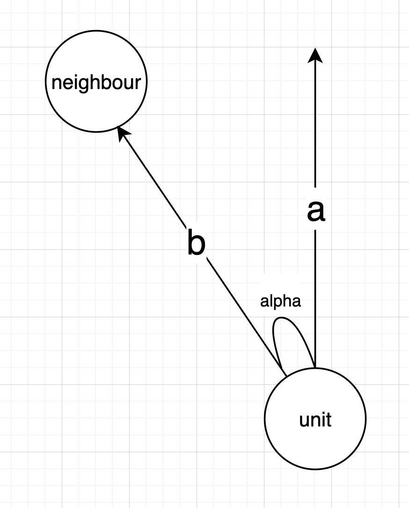
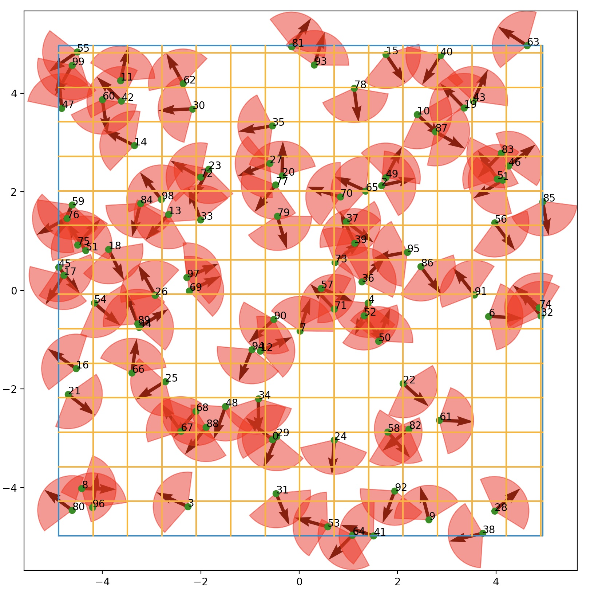
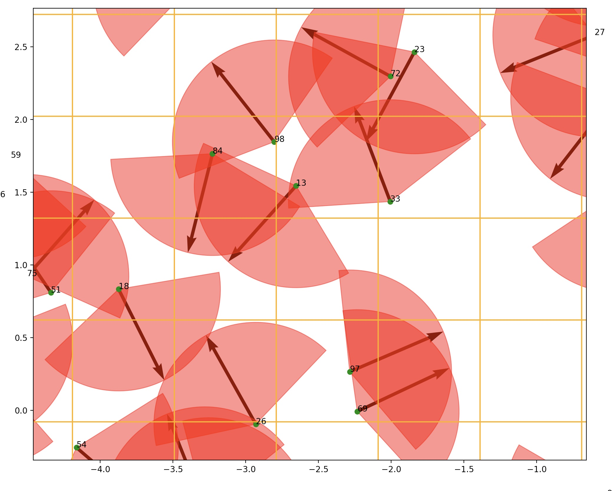

# Data files

You can find data files in "resources" directory.

First line of each file contains angle of sector and view distance.<br>
Other lines contain position and view vectors.

# Task

There is 2D field. It contains many units. Each unit have position and view direction (radius-vector). All units have constant view distance.
You should give an answer, how many units can each unit see?

# How this shit was supposed to work

## Battleground

2D battleground is [CellList](https://en.wikipedia.org/wiki/Cell_lists). Side of each cell equals view distance.<br>
This helps to reduce calculations from O(n^2) to O(n) (if units can't see whole map, I hope they don't).

## Multithread

Multithreading is done using async.<br>
We divide all units into batches and let each thread calculate its batch.
Also, there is mutex pool, because neighbours are calculated and used on run (lazy).

## SIMD
If neighbours >= 4, then we can use SIMD to calculate 4 vectors simultaneously (if I did it right).<br>
Other neighbours would be calculated using slow alghorithm.

## Heap
All units are stored in heap.

Also, I used heap-allocated dynamic arrays to work with SIMD.

## Calculations

<details>
  <summary>TODO</summary>Calculations

UNIT - main unit<br>
NEIGHBOUR - other unit<br>
b - vector from UNIT to NEIGHBOUR <br>
a - unit vector of view <br>
alpha - angle between vectors a and b

How can we know if NEIGHBOUR is in sector of UNIT?

1) |b| <= distance view
2) alpha <= sector angle / 2

Let's find cos alpha:<br>
cos(alpha) = dot(a, b) / |b|<br>
Now we can compare cos(alpha) and cos(sector angle / 2).



</details>

# Tools (python scripts)

You can find tools in "tools" directory.

<details>
  <summary>data_generator.py</summary>

Units generator. You can modify parameters in script.

### Syntax

```
python3 data_generator.py <FILE_NAME_TO_GENERATE> <NUMBER_OF_ELEMENTS> 
```

### Example

Will create file "data.txt" with random 100 units in it.

```
python3 data_generator.py data.txt 100 
```

</details>

<details>
  <summary>data_visualizer.py</summary>

Units visualizer. Will visualize your units ¯\_(ツ)_/¯

### Syntax

```
python3 data_visualizer.py <FILE_NAME_TO_READ> <no/yes> 
```

Last optional parameter asks user if they would like to see number of each unit (this info can lead to low performance :
c).

### Example

Will read and visualize file "data.txt". Number of each unit is also printed.

```
python3 data_visualizer.py data.txt
```

### Images

Your map will look like this. <br>
Each green point is unit. <br>
Each cell is cell in [CellList structure](https://en.wikipedia.org/wiki/Cell_lists)



You can zoom it. Amazing!



</details>
